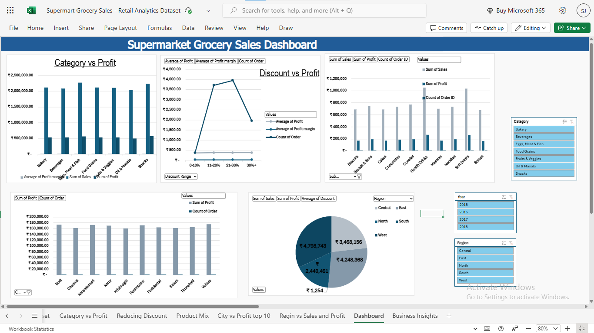

 **Supermart Grocery Sales - Retail Analytics Dataset**

This project analyzes Supermart's retail sales data using Microsoft Excel. It includes data cleaning, pivot table analysis, and the creation of an interactive dashboard to drive business insights.

- Key Features:

1) Data cleaning & transformation for analysis-ready format.

2) Pivot Tables exploring key metrics like:

   a) Category vs Profit

   b)Discount vs Profit

   c)City-wise Top 10 Sales

   d)Regional Sales & Profit Comparison

   e)Product Mix and Margins

3) Interactive Dashboard built with slicers and charts.

### 🖼️ Dashboard Preview

📈 Business Insights:

👉 Highest Profits come from categories like Snacks and Beverages.

👉 Excessive Discounts (>30%) show a drop in profit margin.

👉 Western Region contributes the most to revenue.

✅ Recommendations:

⭐ Limit discount ranges between 11–20% to maintain healthy profit margins.

⭐ Focus on high-performing categories and cities for marketing and stocking.

⭐ Reassess pricing/discount strategy for low-margin categories like Bakery.

**HOW TO USE**

Step 1: Download the Excel file from the project
 folder.

Step 2: Open it in Microsoft Excel (or any compatible spreadsheet tool).

Step 3: Use the interactive dashboard on the final sheet:

Step 4: Filter by Region, City, Category, and more.

Step 5: Analyze metrics like Sales, Profit, Discounts, and Quantities.

Step 6: Pivot tables are included for deeper breakdowns in the workbook.
